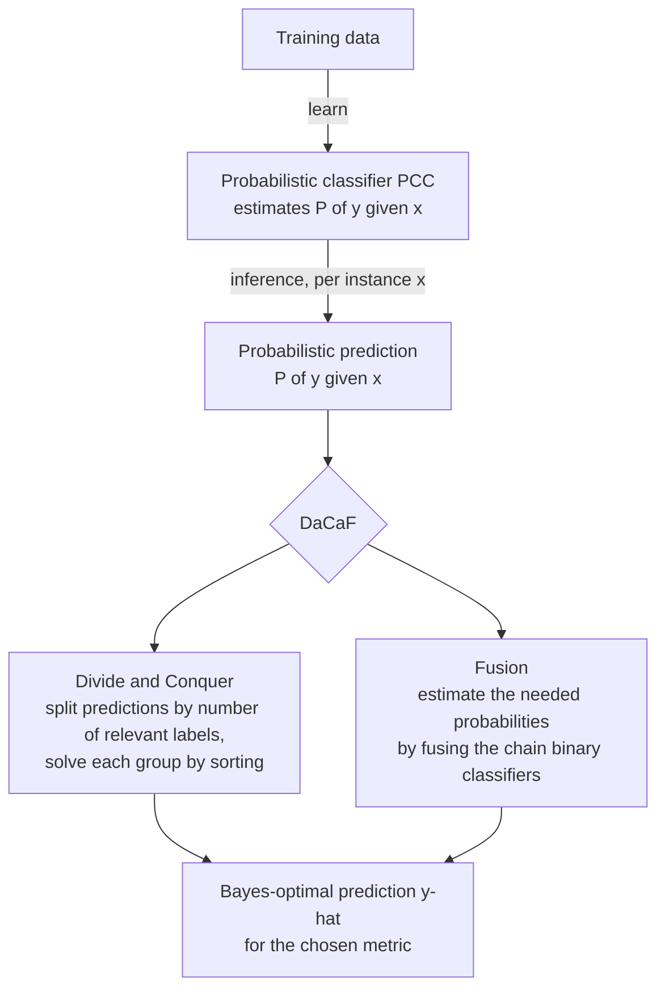

# Probabilistic Multi-Label Classification via Divide-and-Conquer and Fusion (DaCaF)

[](https://doi.org/10.1016/j.inffus.2026.104517)
[](https://doi.org/10.1016/j.inffus.2026.104517)
[](LICENSE)

Official code for the paper **published in _Information Fusion_ (2026)**:

> **Probabilistic multi-label classification via a divide-and-conquer and fusion approach**
> Vu-Linh Nguyen, Xuan-Truong Hoang, Anh Hoang, Van-Nam Huynh.
> *Information Fusion*, 2026, Article 104517. <https://doi.org/10.1016/j.inffus.2026.104517>

---

## What is this about? (in one picture)

In multi-label classification, each instance can carry *any subset* of the labels, and **different evaluation metrics want different predictions**. A model that is great for one metric (e.g. F₁) can be poor for another (e.g. subset accuracy).

**DaCaF** is a generic recipe that, given a probabilistic model `P(y | x)`, finds the **Bayes-optimal prediction (BOP)** for a chosen metric — the prediction `ŷ` that maximises the *expected* score of that metric.



**Two building blocks:**

1. **Divide & Conquer** — partition the `2^L` possible predictions into `L+1` groups (by how many labels are predicted relevant). Within each group the best prediction is found just by **sorting labels by a score**; the global best is the best across groups.
2. **Fusion** — the scores need certain marginal/pairwise probabilities. These are estimated by **fusing the predictions of the dependent binary classifiers** that make up the chain (via ancestral sampling).

The paper proves this works for **two whole families of metrics** (so it covers many metrics at once, not one at a time) and shows when a metric's optimal prediction is *trivial* — a useful warning sign when choosing a metric.

---

## Headline empirical finding

**Mismatch hurts.** When you evaluate with metric *E* but optimise for a different metric *T* during prediction, performance usually drops. Optimising the metric you actually care about is (almost always) best — verified on 5 tabular datasets + a chest-X-ray image dataset, using the *exact* computation paradigm (no approximation blurring the picture).

---

## The metrics and their optimal predictions

For a probabilistic prediction `P(y | x)` over `L` labels, each rule returns the prediction that maximises the expected metric. `pⱼ = P(yⱼ = 1 | x)` is the marginal.

| Metric | Optimal prediction (BOP) | Needs | Cost |
|---|---|---|---|
| **Hamming** | `ŷⱼ = 1 ⇔ pⱼ > ½` | marginals | `O(L)` |
| **Subset 0/1** | the single most probable label vector | full joint | intractable |
| **F-β / F₁** | sort by an F-score, pick best prefix size | pairwise `P(yⱼ=1, |y|=s)` | `O(L³)` |
| **Markedness** | rank by marginals, compare prefix sizes | marginals | `O(L log L)` |
| **Precision** | predict only the top-marginal label | marginals | `O(L)` *(near-trivial)* |
| **NPV** | all ones except the lowest-marginal label | marginals | `O(L)` *(near-trivial)* |
| **Recall** | always predict `1…1` | — | trivial |
| **Specificity** | always predict `0…0` | — | trivial |

> **Why "trivial" matters:** Recall/Specificity (and near-trivial Precision/NPV) have optimal predictions you can write down *without looking at any data*. The paper argues such metrics are weak *standalone* evaluation metrics — a practical takeaway when designing a metric for a new domain.

---

## How to cite

```bibtex
@article{nguyen2026probabilistic,
  title   = {Probabilistic multi-label classification via a divide-and-conquer and fusion approach},
  author  = {Nguyen, Vu-Linh and Hoang, Xuan-Truong and Hoang, Anh and Huynh, Van-Nam},
  journal = {Information Fusion},
  year    = {2026},
  pages   = {104517},
  issn    = {1566-2535},
  doi     = {10.1016/j.inffus.2026.104517}
}
```

---

## Quickstart

```bash
conda create -n inference_prob_mlc python=3.10
conda activate inference_prob_mlc
pip install -r requirements.txt

# one (dataset, seed, model) run:
python inference_evaluate_models.py --dataset emotions --seed 1 --estimator lr --output-dir result
```

This writes `result/emotions/seed1_lr.csv` and a cross-tab of **target metric × evaluation metric** — the table at the heart of the paper.

---

## Reproducing the paper's results

The paper uses **Probabilistic Classifier Chains (PCC)** with an **L2-regularised logistic-regression** base learner, **10-fold cross-validation**, and the **exact computation paradigm** (enumerate all `2^L` labelings, so it is limited to a small/moderate number of labels).

**Datasets in the paper (6):**

| Dataset | #labels (L) | #instances | Type |
|---|---:|---:|---|
| Emotions | 6 | 593 | tabular |
| CHD-49 | 6 | 555 | tabular |
| Scene | 6 | 2407 | tabular |
| Water-quality | 14 | 1060 | tabular |
| Yeast | 14 | 2417 | tabular |
| ChestX-ray8 | 8 | 25596 | image (ResNet / resnetAE / DenseNet features) |

For the chest-X-ray data we extract features with a pretrained backbone via [TorchXRayVision](https://github.com/mlmed/torchxrayvision); the raw NIH features are **not redistributed** (see [`src/chest_xray_dataset/Readme.md`](src/chest_xray_dataset/Readme.md)).

**Full sweep** (heavy — use a cluster):

```bash
python inference_evaluate_models.py        # local, small datasets
# or: see slurm/README.md                  # one job per (dataset × seed × estimator)
python slurm/aggregate.py                  # aggregate when jobs finish
```

Aggregated outputs per dataset: `result/result_<dataset>.csv` (long format), `_summary.csv` (mean ± std), and `_crosstab.csv` (target × evaluation pivot).

---

## Repository layout

```
src/
  probability_classifier_chains.py   # PCC + per-metric Bayes-optimal predict_* rules
  evaluation_metrics.py              # all metrics (higher-is-better form)
  arff_dataset.py                    # MULAN ARFF loader + 10-fold CV
  chest_xray_dataset/                # NIH feature loader
  utils.py                           # result aggregation
inference_evaluate_models.py         # pipeline: train × predict × evaluate
slurm/                               # cluster submission + aggregation
tests/                               # unit tests + brute-force equivalence checks
result/                              # output CSVs
paper/                               # local copy of the paper source (not tracked)
```

---

## Testing

```bash
python -m pytest tests/ -v
```

Every inference rule is checked against **brute-force enumeration** of the expected metric, so the closed-form rules are provably correct on small cases. A batched predictor (one `predict_proba` call per chain level instead of `N·L·2^L`) is verified numerically equivalent to the reference enumeration.

---

## Beyond the paper (also in this code)

The repository ships a few extras not used in the published experiments, handy for further study:

- a **Binary Relevance** baseline (label-independence) sharing the same inference interface, to isolate the effect of chain-aware inference;
- additional MULAN benchmarks (`flags`, `VirusGO`, `PlantPseAAC`, …) and base learners (Random Forest, AdaBoost);
- an **Informedness** rule with a corrected derivation (the paper's appendix discusses it; it is not part of the main experiments).

---

## References

- K. Dembczyński, W. Cheng, E. Hüllermeier. *Bayes Optimal Multilabel Classification via Probabilistic Classifier Chains.* ICML 2010.
- K. Dembczyński, W. Waegeman, W. Cheng, E. Hüllermeier. *An Exact Algorithm for F-Measure Maximization.* NeurIPS 2011.
- W. Waegeman et al. *On the Bayes-optimality of F-measure maximizers.* JMLR 2014.
- D. M. W. Powers. *Evaluation: From Precision, Recall and F-Measure to ROC, Informedness, Markedness & Correlation.* 2011.
- G. Tsoumakas, I. Katakis, I. Vlahavas. *Mining Multi-label Data.* 2010 (MULAN).

## License

MIT — see [LICENSE](LICENSE).
