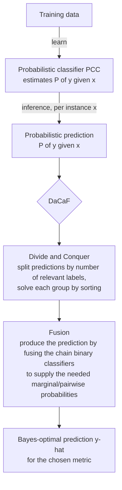

# Probabilistic Multi-Label Classification via Divide-and-Conquer and Fusion (DaCaF)

[](https://doi.org/10.1016/j.inffus.2026.104517)
[](https://doi.org/10.1016/j.inffus.2026.104517)
[](https://doi.org/10.5281/zenodo.20572638)
[](https://codeocean.com/capsule/1580907/tree)
[](https://pypi.org/project/dacaf-mlc/)
[](https://pypi.org/project/dacaf-mlc/)
[](LICENSE)

Official code for the paper **published in _Information Fusion_ (2026)**:

> **Probabilistic multi-label classification via a divide-and-conquer and fusion approach**
> Vu-Linh Nguyen, Xuan-Truong Hoang, Anh Hoang, Van-Nam Huynh.
> *Information Fusion*, 2026, Article 104517. <https://doi.org/10.1016/j.inffus.2026.104517>

---

## What is this about? (in one picture)

In multi-label classification, each instance can carry *any subset* of the labels, and **different evaluation metrics want different predictions**. A model that is great for one metric (e.g. F₁) can be poor for another (e.g. subset accuracy).

**DaCaF** is a generic recipe that, given a probabilistic model `P(y | x)`, finds the **Bayes-optimal prediction (BOP)** for a chosen metric: the prediction `ŷ` that maximises the *expected* score of that metric.



**Two building blocks:**

1. **Divide & Conquer**: partition the `2^L` possible predictions into `L+1` groups (by how many labels are predicted relevant). Within each group the best prediction is found just by **sorting labels by a score**; the global best is the best across groups.
2. **Fusion**: the final step that produces the prediction. The sorting scores need certain marginal/pairwise probabilities, which are supplied by **fusing the predictions of the dependent binary classifiers** that make up the chain (via ancestral sampling).

The paper proves this works for **two whole families of metrics** (so it covers many metrics at once, not one at a time) and shows when a metric's optimal prediction is *trivial*, a useful warning sign when choosing a metric.

---

## Results at a glance

**The headline finding: mismatch hurts.** When you evaluate with metric *E* but optimise for a different metric *T* during prediction, performance usually drops. Optimising the metric you actually care about is (almost always) best. This is verified on 5 tabular datasets plus a chest-X-ray image dataset, using the *exact* computation paradigm (no approximation blurring the picture).

You read the table **column by column**: each column is one evaluation metric, each row is the metric you optimised for. The **bold diagonal** (optimise the metric you evaluate) should be the largest value in its column.

**Example: CHD-49 (PCC + logistic regression, mean over 5 seeds × 10-fold, the fastest dataset).** Values are percentages, higher is better. Bold = the maximum of its column = the rule that targets that metric.

| Target ↓ \ Eval → | F₁ | Hamming | Markedness | Precision | NPV | Recall | Subset |
|---|---:|---:|---:|---:|---:|---:|---:|
| **F₁** | **67.1** | 69.3 | 71.9 | 62.7 | 81.1 | 79.2 | 15.1 |
| **Hamming** | 63.9 | **70.8** | 71.3 | 66.6 | 75.7 | 66.9 | 18.1 |
| **Markedness** | 34.2 | 63.7 | **77.0** | 33.4 | 71.1 | 40.5 | 8.4 |
| **Precision** | 40.5 | 64.8 | 68.3 | **73.5** | 63.1 | 29.1 | 3.1 |
| **NPV** | 58.4 | 43.0 | 71.5 | 43.0 | **100.0** | 99.5 | 0.0 |
| **Recall** | 58.4 | 43.0 | 71.5 | 43.0 | 100.0 | **99.5** | 0.0 |
| **Subset** | 64.0 | 69.4 | 70.4 | 64.2 | 76.5 | 69.8 | **18.9** |

In all **7 of 7** columns the diagonal (target = evaluation) is the maximum: to score best on a metric, optimise that metric. The NPV and Recall rows are identical because both BOPs are the all-ones vector `1…1` (see the metrics table below).

---

## Install

To **use DaCaF as a library**, install the released package from PyPI:

```bash
pip install dacaf-mlc          # core (tabular); add "dacaf-mlc[image]" for the ChestX-ray experiments
```

To **reproduce the paper** (datasets, sweeps, lockfile), use the editable install from a clone below.

## Quickstart (one run)

Using [**uv**](https://docs.astral.sh/uv/) (recommended, fast; a checked-in `uv.lock` pins exact versions):

```bash
uv venv .venv --python 3.11 && source .venv/bin/activate
uv pip install -e .          # core (tabular) deps; add ".[image]" for the ChestX-ray experiments
# reproducible install from the lockfile instead: uv sync            (add --extra image for ChestX-ray)

# one (dataset, seed) run:
dacaf-mlc --dataset emotions --seed 1 --output-dir result
# or without activating a venv: uv run dacaf-mlc --dataset emotions --seed 1 --output-dir result
```

<details><summary>Alternative: plain pip / conda</summary>

```bash
python -m venv .venv && source .venv/bin/activate    # or conda create -n dacaf python=3.10
pip install -e .            # core (tabular) deps; add ".[image]" for the ChestX-ray experiments
dacaf-mlc --dataset emotions --seed 1 --output-dir result
```
</details>

This writes `result/emotions/seed1_all.csv` and a cross-tab of **target metric × evaluation metric**, the table at the heart of the paper.

---

## The metrics and their optimal predictions

For a probabilistic prediction `P(y | x)` over `L` labels, each rule returns the prediction that maximises the expected metric. `pⱼ = P(yⱼ = 1 | x)` is the marginal.

**How to read the columns:** *Needs* is the probabilistic information the rule consumes (cheap **marginals** `pⱼ`, the harder **pairwise** terms, or the full joint). *Cost* is the per-instance time once that information is available. Rules marked *trivial* / *near-trivial* have a BOP you can write down without looking at any data.

| Metric | Optimal prediction (BOP) | Needs | Cost |
|---|---|---|---|
| **Hamming** | `ŷⱼ = 1 ⇔ pⱼ > ½` | marginals | `O(L)` |
| **Subset 0/1** | the single most probable label vector | full joint | intractable |
| **F-β / F₁** | sort by an F-score, pick best prefix size | pairwise `P(yⱼ=1, |y|=s)` | `O(L³)` |
| **Markedness** | rank by marginals, compare prefix sizes | marginals | `O(L log L)` |
| **Precision** | predict only the top-marginal label | marginals | `O(L)` *(near-trivial)* |
| **NPV** | predict all ones `1…1` (same BOP as Recall here); falls back to `ŷ^{K-1}` (all ones but the lowest-marginal label) only if `1…1` is disallowed | marginals | `O(L)` *(near-trivial)* |
| **Recall** | always predict `1…1` | none | trivial |
| **Specificity** | always predict `0…0` | none | trivial |

> **Why "trivial" matters:** Recall/Specificity (and near-trivial Precision/NPV) have optimal predictions you can write down *without looking at any data*. The paper argues such metrics are weak *standalone* evaluation metrics, a practical takeaway when designing a metric for a new domain.

---

## Reproducing the paper's results

The paper uses **Probabilistic Classifier Chains (PCC)** with an **L2-regularised logistic-regression** base learner, **10-fold cross-validation**, and the **exact computation paradigm** (enumerate all `2^L` labelings, so it is limited to a small or moderate number of labels). The exact published protocol is recorded in [`docs/paper.yaml`](docs/paper.yaml).

**Datasets in the paper (6):**

| Dataset | #labels (L) | #instances | Type |
|---|---:|---:|---|
| Emotions | 6 | 593 | tabular |
| CHD-49 | 6 | 555 | tabular |
| Scene | 6 | 2407 | tabular |
| Water-quality | 14 | 1060 | tabular |
| Yeast | 14 | 2417 | tabular |
| ChestX-ray8 | 8 | 25596 | image (ResNet / resnetAE / DenseNet features) |

For the chest-X-ray data we extract features with a pretrained backbone via [TorchXRayVision](https://github.com/mlmed/torchxrayvision); the raw NIH features are **not redistributed** (see [`dacaf_mlc/chest_xray_dataset/Readme.md`](dacaf_mlc/chest_xray_dataset/Readme.md)).

**One command** for the tractable (tabular) subset, runs the 5 tabular datasets × 5 seeds and aggregates:

```bash
make reproduce          # = bash scripts/reproduce_tabular.sh
```

**Full sweep** (heavy, use a cluster):

```bash
dacaf-mlc --dataset CHD_49 --seed 1        # one job per (dataset, seed); repeat as needed
python scripts/aggregate.py                # aggregate when jobs finish
```

Aggregated outputs per dataset: `result/result_<dataset>.csv` (long format), `_summary.csv` (mean ± std), and `_crosstab.csv` (target × evaluation pivot).

### Run it online (Code Ocean)

A one-click reproducible capsule is available: **<https://codeocean.com/capsule/1580907/tree>**. Click **Reproducible Run** to rebuild the environment and reproduce the CHD-49 target × evaluation table (`result_CHD_49_crosstab.csv`) on CPU in seconds — every diagonal entry is the maximum of its column, the paper's central claim. The capsule entry point is [`run`](run); dependencies are pinned in [`requirements-core.txt`](requirements-core.txt).

---

## Library usage

```python
from sklearn.linear_model import LogisticRegression
from dacaf_mlc.probability_classifier_chains import ProbabilisticClassifierChain
from dacaf_mlc.evaluation_metrics import EvaluationMetrics as EM

pcc = ProbabilisticClassifierChain(LogisticRegression(max_iter=10_000))
pcc.fit(X_train, Y_train)                 # Y: (n, L) binary

y_f1   = pcc.predict_fmeasure(X_test, beta=1)   # Bayes-optimal for F1
y_ham  = pcc.predict_hamming(X_test)            # ... for Hamming
y_mar  = pcc.predict_markedness(X_test)         # ... for Markedness

print(EM.f_beta(Y_test, y_f1), EM.markedness(Y_test, y_mar))
```

Every `predict_*` rule returns the prediction that maximises the expected value of its
target metric (see [`CONVENTIONS.md`](CONVENTIONS.md) for the exact rules and conventions).

---

## Repository layout

```
dacaf_mlc/                           # installable package
  probability_classifier_chains.py   # PCC + the 7 per-metric Bayes-optimal predict_* rules
  evaluation_metrics.py              # the 7 paper metrics (higher-is-better form)
  arff_dataset.py                    # MULAN ARFF loader + 10-fold CV
  datasets.py                        # dataset registry + loaders
  metrics_registry.py                # which metrics run on which inference rule
  pipeline.py                        # training / k-fold eval / run_single
  evaluate.py                        # CLI entry point (dacaf-mlc): parse_args + main
  config.py                          # paths + protocol constants
  utils.py                           # result aggregation
  chest_xray_dataset/                # NIH feature extractor + loader ([image] extra)
  skmultiflow/                       # vendored ClassifierChain base
pyproject.toml                       # packaging + deps (core / [image] / [dev])
scripts/                             # reproduce_tabular.sh + Slurm cluster scripts
tests/                               # unit tests + brute-force optimality + e2e
docs/                                # paper.yaml protocol manifest
datasets/                            # the paper's MULAN ARFFs (+ chest-xray label CSV)
result/                              # aggregated result CSVs
CONVENTIONS.md  CONTRIBUTING.md  CITATION.cff
paper/                               # local copy of the paper source (not tracked)
```

---

## Testing

```bash
python -m pytest tests/ -v
```

Every inference rule is checked against **brute-force enumeration** of the expected metric, so the closed-form rules are provably correct on small cases. A batched predictor (one `predict_proba` call per chain level instead of `N·L·2^L`) is verified numerically equivalent to the reference enumeration.

---

## How to cite

```bibtex
@article{nguyen2026probabilistic,
  title   = {Probabilistic multi-label classification via a divide-and-conquer and fusion approach},
  author  = {Nguyen, Vu-Linh and Hoang, Xuan-Truong and Hoang, Anh and Huynh, Van-Nam},
  journal = {Information Fusion},
  year    = {2026},
  pages   = {104517},
  issn    = {1566-2535},
  doi     = {10.1016/j.inffus.2026.104517}
}
```

---

## References

- K. Dembczyński, W. Cheng, E. Hüllermeier. *Bayes Optimal Multilabel Classification via Probabilistic Classifier Chains.* ICML 2010.
- K. Dembczyński, W. Waegeman, W. Cheng, E. Hüllermeier. *An Exact Algorithm for F-Measure Maximization.* NeurIPS 2011.
- W. Waegeman et al. *On the Bayes-optimality of F-measure maximizers.* JMLR 2014.
- D. M. W. Powers. *Evaluation: From Precision, Recall and F-Measure to ROC, Informedness, Markedness & Correlation.* 2011.
- G. Tsoumakas, I. Katakis, I. Vlahavas. *Mining Multi-label Data.* 2010 (MULAN).

## Acknowledgements

The `dacaf_mlc/skmultiflow/` directory contains a trimmed, vendored subset of
[scikit-multiflow](https://github.com/scikit-multiflow/scikit-multiflow)
(the `ClassifierChain` base and its supporting utilities), redistributed under
its original 3-clause BSD license. See
[`dacaf_mlc/skmultiflow/LICENSE`](dacaf_mlc/skmultiflow/LICENSE) for the full text.

## License

MIT for the original DaCaF code, see [LICENSE](LICENSE). Vendored third-party
code retains its own license as noted in Acknowledgements above.
